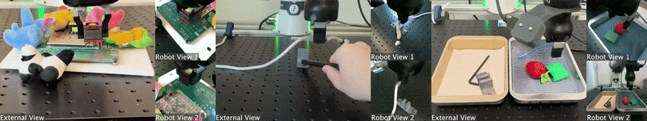

# SERL: A Software Suite for Sample-Efficient Robotic Reinforcement Learning


[](https://opensource.org/licenses/MIT)
[](https://serl-robot.github.io/)



**Webpage: [https://serl-robot.github.io/](https://serl-robot.github.io/)**

SERL provides a set of libraries, env wrappers, and examples to train RL policies for robotic manipulation tasks. The following sections describe how to use SERL. We will illustrate the usage with examples.

🎬: [SERL video](https://www.youtube.com/watch?v=Um4CjBmHdcw), [additional video](https://www.youtube.com/watch?v=17NrtKHdPDw) on sample efficient RL.

**Table of Contents**
- [SERL: A Software Suite for Sample-Efficient Robotic Reinforcement Learning](#serl-a-software-suite-for-sample-efficient-robotic-reinforcement-learning)
  - [Installation](#installation)
  - [Overview and Code Structure](#overview-and-code-structure)
  - [Quick Start with SERL in Sim](#quick-start-with-serl-in-sim)
  - [Run with Franka Arm on Real Robot](#run-with-franka-arm-on-real-robot)
  - [Contribution](#contribution)
  - [Citation](#citation)

## Major updates
#### June 24, 2024
For people who use SERL for tasks involving controlling the gripper (e.g.,pick up objects), we strong recommend adding a small penalty to the gripper action change, as it will greatly improves the training speed.
For detail, please refer to: [PR #65](https://github.com/rail-berkeley/serl/pull/65).


Further, we also recommend  providing interventions online during training in addition to loading the offline demos. If you have a Franka robot and SpaceMouse, this can be as easy as just touching the SpaceMouse during training.

#### April 25, 2024
We fixed a major issue in the intervention action frame. See release [v0.1.1](https://github.com/rail-berkeley/serl/releases/tag/v0.1.1) Please update your code with the main branch.

## Installation
1. **Setup Conda Environment:**
    create an environment with
    ```bash
    conda create -n serl python=3.10
    ```

2. **Install Jax as follows:**
    - For CPU (not recommended):
        ```bash
        pip install --upgrade "jax[cpu]"
        ```

    - For GPU:
        ```bash
        pip install --upgrade "jax[cuda12]==0.4.28" -f https://storage.googleapis.com/jax-releases/jax_cuda_releases.html
        ```

    - For TPU
        ```bash
        pip install --upgrade "jax[tpu]" -f https://storage.googleapis.com/jax-releases/libtpu_releases.html
        ```
    - See the [Jax Github page](https://github.com/google/jax) for more details on installing Jax.

3. **Install the serl_launcher**
    ```bash
    cd serl_launcher
    pip install -e .
    pip install -r requirements.txt
    ```

## Overview and Code Structure

SERL provides a set of common libraries for users to train RL policies for robotic manipulation tasks. The main structure of running the RL experiments involves having an actor node and a learner node, both of which interact with the robot gym environment. Both nodes run asynchronously, with data being sent from the actor to the learner node via the network using [agentlace](https://github.com/youliangtan/agentlace). The learner will periodically synchronize the policy with the actor. This design provides flexibility for parallel training and inference.

<p align="center">
  
</p>

**Table for code structure**

| Code Directory | Description |
| --- | --- |
| [serl_launcher](https://github.com/rail-berkeley/serl/blob/main/serl_launcher) | Main code for SERL |
| [serl_launcher.agents](https://github.com/rail-berkeley/serl/blob/main/serl_launcher/serl_launcher/agents/) | Agent Policies (e.g. DRQ, SAC, BC) |
| [serl_launcher.wrappers](https://github.com/rail-berkeley/serl/blob/main/serl_launcher/serl_launcher/wrappers) | Gym env wrappers |
| [serl_launcher.data](https://github.com/rail-berkeley/serl/blob/main/serl_launcher/serl_launcher/data) | Replay buffer and data store |
| [serl_launcher.vision](https://github.com/rail-berkeley/serl/blob/main/serl_launcher/serl_launcher/vision) | Vision related models and utils |
| [franka_sim](./franka_sim) | Franka mujoco simulation gym environment |
| [serl_robot_infra](./serl_robot_infra/) | Robot infra for running with real robots |
| [serl_robot_infra.robot_servers](https://github.com/rail-berkeley/serl/blob/main/serl_robot_infra/robot_servers/) | Flask server for sending commands to robot via ROS |
| [serl_robot_infra.franka_env](https://github.com/rail-berkeley/serl/blob/main/serl_robot_infra/franka_env/) | Gym env for real franka robot |

## Quick Start with SERL in Sim

We provide a simulated environment for trying out SERL with a franka robot.

Check out the [Quick Start with SERL in Sim](/docs/sim_quick_start.md)
 - [Training from state observation example](/docs/sim_quick_start.md#1-training-from-state-observation-example)
 - [Training from image observation example](/docs/sim_quick_start.md#2-training-from-image-observation-example)
 - [Training from image observation with 20 demo trajectories example](/docs/sim_quick_start.md#3-training-from-image-observation-with-20-demo-trajectories-example)

## Run with Franka Arm on Real Robot

We provide a step-by-step guide to run RL policies with SERL on the real Franka robot.

Check out the [Run with Franka Arm on Real Robot](/docs/real_franka.md)
 - [Peg Insertion 📍](/docs/real_franka.md#1-peg-insertion-📍)
 - [PCB Component Insertion 🖥️](/docs/real_franka.md#2-pcb-component-insertion-🖥️)
 - [Cable Routing 🔌](/docs/real_franka.md#3-cable-routing-🔌)
 - [Object Relocation 🗑️](/docs/real_franka.md#4-object-relocation-🗑️)

## Contribution

We welcome contributions to this repository! Fork and submit a PR if you have any improvements to the codebase. Before submitting a PR, please run `pre-commit run --all-files` to ensure that the codebase is formatted correctly.

## Citation

If you use this code for your research, please cite our paper:

```bibtex
@misc{luo2024serl,
      title={SERL: A Software Suite for Sample-Efficient Robotic Reinforcement Learning},
      author={Jianlan Luo and Zheyuan Hu and Charles Xu and You Liang Tan and Jacob Berg and Archit Sharma and Stefan Schaal and Chelsea Finn and Abhishek Gupta and Sergey Levine},
      year={2024},
      eprint={2401.16013},
      archivePrefix={arXiv},
      primaryClass={cs.RO}
}
```
