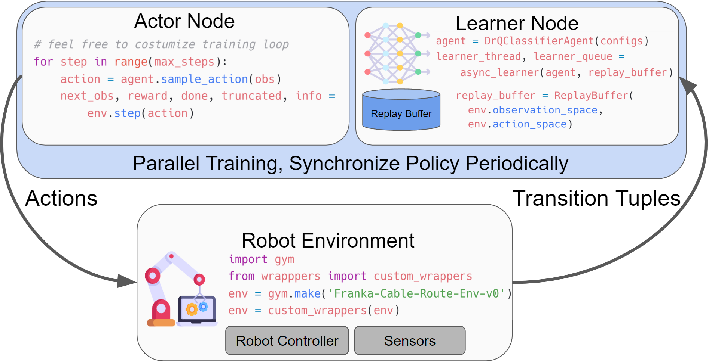
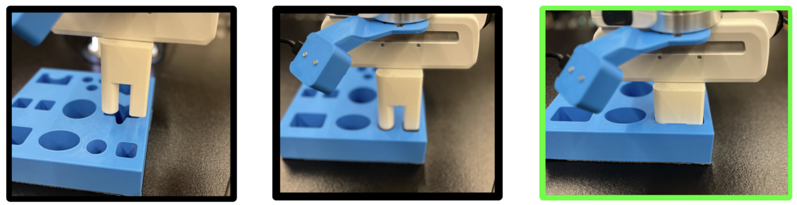
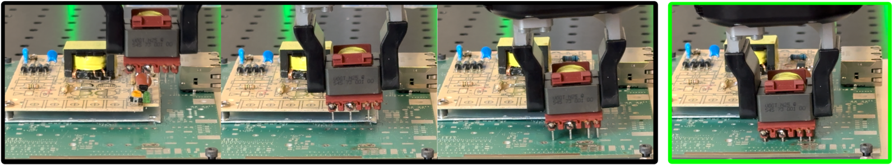

# SERL: A Software Suite for Sample-Efficient Robotic Reinforcement Learning


[](https://opensource.org/licenses/MIT)
[](https://serl-robot.github.io/)


**Webpage: [https://serl-robot.github.io/](https://serl-robot.github.io/)**

SERL provides a set of libraries, env wrappers, and examples to train RL policies for robotic manipulation tasks. The following sections describe how to use SERL. We will illustrate the usage with examples.

**Table of Contents**
- [SERL: A Software Suite for Sample-Efficient Robotic Reinforcement Learning](#serl-a-software-suite-for-sample-efficient-robotic-reinforcement-learning)
  - [Installation](#installation)
  - [Overview and Code Structure](#overview-and-code-structure)
  - [Quick Start with Franka Arm in Sim](#quick-start-with-franka-arm-in-sim)
    - [1. Training from state observation example](#1-training-from-state-observation-example)
    - [2. Training from image observation example](#2-training-from-image-observation-example)
    - [3. Training from image observation with 20 demo trajectories example](#3-training-from-image-observation-with-20-demo-trajectories-example)
  - [Run with Franka Arm on Real Robot](#run-with-franka-arm-on-real-robot)
    - [1. Peg Insertion 📍](#1-peg-insertion-)
      - [Procedure](#procedure)
    - [2. PCB Component Insertion 🖥️](#2-pcb-component-insertion-️)
    - [3. Cable Routing 🔌](#3-cable-routing-)
    - [4. Object Relocation 🗑️](#4-object-relocation-️)
  - [Citation](#citation)

---

## Installation
1. **Setup Conda Environment:**
    create an environment with
    ```bash
    conda create -n serl python=3.10
    ```

2. **Install Jax as follows:**
    - For CPU (not recommended):
        ```bash
        pip install --upgrade "jax[cpu]"
        ```

    - For GPU: (change cuda12 to cuda11 if you are using older driver versions)
        ```bash
        pip install --upgrade "jax[cuda12_pip]" -f https://storage.googleapis.com/jax-releases/jax_cuda_releases.html
        ```

    - For TPU
        ```bash
        pip install --upgrade "jax[tpu]" -f https://storage.googleapis.com/jax-releases/libtpu_releases.html
        ```
    - See the [Jax Github page](https://github.com/google/jax) for more details on installing Jax.

3. **Install the serl_launcher**
    ```bash
    cd serl_launcher
    pip install -e .
    pip install -r requirements.txt
    ```

4. **Install Franka Sim library (Optional)**
    ```bash
    cd franka_sim
    pip install -e .
    pip install -r requirements.txt
    ```

Try if franka_sim is running via `python franka_sim/franka_sim/test/test_gym_env_human.py`

---

## Overview and Code Structure

SERL provides a set of common libraries for users to train RL policies for robotic manipulation tasks. The main structure of running the RL experiments involves having an actor node and a learner node, both of which interact with the robot gym environment. Both nodes run asynchronously, with data being sent from the actor to the learner node via the network using [agentlace](https://github.com/youliangtan/agentlace). The learner will periodically synchronize the policy with the actor. This design provides flexibility for parallel training and inference.

<p align="center">
  
</p>

**Table for code structure**

| Code Directory | Description |
| --- | --- |
| [serl_launcher](./serl_launcher) | Main code for SERL |
| [serl_launcher.agents](./serl_launcher/serl_launcher/agents/) | Agent Policies (e.g. DRQ, SAC, BC) |
| [serl_launcher.wrappers](./serl_launcher/serl_launcher/wrappers) | Gym env wrappers |
| [serl_launcher.data](./serl_launcher/serl_launcher/data) | Replay buffer and data store |
| [serl_launcher.vision](./serl_launcher/serl_launcher/vision) | Vision related models and utils |
| [franka_sim](./franka_sim) | Franka mujoco simulation gym environment |
| [serl_robot_infra](./serl_robot_infra/) | Robot infra for running with real robots |
| [serl_robot_infra.robot_servers](./serl_robot_infra/robot_servers/) | Flask server for sending commands to robot via ROS |
| [serl_robot_infra.franka_env](./serl_robot_infra/franka_env/) | Gym env for real franka robot |

---

## Quick Start with Franka Arm in Sim

Before beginning, please make sure that the simulation environment with `franka_sim` is working.

Note to set `MUJOCO_GL` as egl if you are doing off-screen rendering.
You can do so by ```export MUJOCO_GL=egl``` and remember to set the rendering argument to False in the script.

### 1. Training from state observation example

One-liner launcher (requires `tmux`, `sudo apt install tmux`):):
```bash
bash examples/async_sac_state_sim/tmux_launch.sh
```

<details>
  <summary>Click to show detailed commands</summary>

```bash
cd examples/async_sac_state_sim
```

Run learner node:
```bash
bash run_learner.sh
```

Run actor node with rendering window:
```bash
# add --ip x.x.x.x if running on a different machine
bash run_actor.sh
```

You can optionally launch the learner and actor on separate machines. For example, if the learner node is running on a PC with `ip=x.x.x.x`, you can launch the actor node on a different machine with internet access to `ip=x.x.x.x` and add `--ip x.x.x.` to the commands in `run_actor.sh`.

</details>

### 2. Training from image observation example

One-liner launcher (requires `tmux`, `sudo apt install tmux`):
```bash
bash examples/async_drq_sim/tmux_launch.sh
```

<details>
  <summary>Click to show detailed commands</summary>

```bash
cd examples/async_drq_sim

# to use pre-trained ResNet weights, please download
# note manual download is only for now, once repo is public, auto download will work
wget https://github.com/rail-berkeley/serl/releases/download/resnet10/resnet10_params.pkl
```

Run learner node:
```bash
bash run_learner.sh
```

Run actor node with rendering window:
```bash
# add --ip x.x.x.x if running on a different machine
bash run_actor.sh
```

</details>

### 3. Training from image observation with 20 demo trajectories example

One-liner launcher (requires `tmux`):
```bash
bash examples/async_sac_image_sim/tmux_launch.sh
```

<details>
  <summary>Click to show detailed commands</summary>

```bash
cd examples/async_rlpd_drq_sim

# to use pre-trained ResNet weights, please download
# note manual download is only for now, once repo is public, auto download will work
wget https://github.com/rail-berkeley/serl/releases/download/resnet10/resnet10_params.pkl

# download 20 demo trajectories
wget \
https://github.com/rail-berkeley/serl/releases/download/franka_sim_lift_cube_demos/franka_lift_cube_image_20_trajs.pkl
```

Run learner node:
```bash
bash run_learner.sh
```

Run actor node with rendering window:
```bash
# add --ip x.x.x.x if running on a different machine
bash run_actor.sh
```

</details>

---

## Run with Franka Arm on Real Robot

We demonstrate how to use SERL with real robot manipulators with 4 different tasks. Namely: Peg Insertion, PCB Component Insertion, Cable Routing, and Object Relocation. We provide detailed instruction on how to reproduce the Peg Insertion task as a setup test for the entire SERL package. 

When running with a real robot, a separate gym env is needed. For our examples, we isolated the gym env as a client to a robot server. The robot server is a Flask server that sends commands to the robot via ROS. The gym env communicates with the robot server via post requests.


This requires the installation of the following packages:

- [serl_franka_controller](https://github.com/rail-berkeley/serl_franka_controller)
- `serl_robot_infra`: [readme](serl_robot_infra/README.md)

Follow the README in `serl_robot_infra` for basic robot operation instructions.


*NOTE: The following code will not run as it is, since it will require custom data, checkpoints, and robot env. We provide the code as a reference for how to use SERL with real robots. Learn this section in incremental order, starting from the first task (peg insertion) to the last task (bin relocation). Modify the code according to your needs. *

### 1. Peg Insertion 📍



> Example is located in [examples/async_peg_insert_drq/](./examples/async_peg_insert_drq/)

> Env and default config are located in `serl_robot_infra/franka_env/envs/peg_env/`

> The `franka_env.envs.wrappers.SpacemouseIntervention` gym wrapper provides the ability to intervene the robot with a spacemouse

The peg insertion task is best for getting started with running SERL on a real robot. As the policy should converge and achieve 100% success rate within 30 minutes on a single GPU in the simplest case, this task is great for trouble-shooting the setup quickly. The procedure below assumes you have a Franka arm with a Robotiq Hand-E gripper and 2 RealSense D405 cameras.

#### Procedure
1. 3D-print (1) **Assembly Object** of choice and (1) corresponding **Assembly Board** from the **Single-Object Manipulation Objects** section of [FMB](https://functional-manipulation-benchmark.github.io/files/index.html). Fix the board to the workspace and grasp the peg with the gripper.
2. 3D-print (2) wrist camera mounts for the RealSense D405 and install onto the threads on the Robotiq Gripper. Update the camera serial numbers in `REALSENSE_CAMERAS` located in [peg_env/config.py](./serl_robot_infra/franka_env/envs/peg_env/config.py).
3. The reward is given by checking the end-effector pose matches a fixed target pose. Manually move the arm into a pose where the peg is inserted into the board and update the `TARGET_POSE` in [peg_env/config.py](./serl_robot_infra/franka_env/envs/peg_env/config.py) with the measured end-effector pose.
4. Set `RANDOM_RESET` to `False` inside the config file to speedup training. Note the policy would only generalize to any board pose when this is set to `True`, but only try this after the basic task works. 
5. Record 20 demo trajectories with the spacemouse. 
    ```bash
    python record_demo.py
    ```
    The trajectories are saved in `examples/async_peg_insert_drq/peg_insertion_20_trajs_{UUID}.pkl`.
6. Train the RL agent with the collected demos by running both learner and actor nodes.
    ```bash
    bash run_learner.sh
    bash run_actor.sh
    ```
7. If nothing went wrong, the policy should converge with 100% success rate within 30 minutes without `RANDOM_RESET` and 60 minutes with `RANDOM_RESET`.
8. The checkpoints are automatically saved and can be evaluated with:
    ```bash
    bash run_actor.sh
    ```
    If the policy is trained with `RANDOM_RESET`, it should be able to insert the peg even when you move the board at test time.

### 2. PCB Component Insertion 🖥️



> Example is located in [examples/async_pcb_insert_drq/](./examples/async_pcb_insert_drq/)

> Env and default config are located in `serl_robot_infra/franka_env/envs/pcb_env/`

Similar to peg insertion, here we record demo trajectories with the robot, then run the learner and actor nodes.
```bash
# record demo trajectories
python record_demo.py

# run learner and actor nodes
bash run_learner.sh
bash run_actor.sh
```

A baseline of using BC as policy is also provided. To train BC, simply run the following command:
```bash
python3 examples/bc_policy.py ....TODO_ADD_ARGS.....
```

To run the BC policy, simply run the following command:
```bash
bash run_bc.sh
```

### 3. Cable Routing 🔌


> Example is located in [examples/async_cable_routing_drq/](./examples/async_cable_routing_drq/)

> Env and default config are located in `serl_robot_infra/franka_env/envs/cable_env/`

In this cable routing task, we provided an example of a reward classifier. This replaced the hardcoded reward classifier which depends on the known `TARGET_POSE` defined in the `config.py`. The reward classifier is an image-based classifier (pretrained ResNet), which is trained to classify whether the cable is routed successfully or not. The reward classifier is trained with demo trajectories of successful and failed samples.

```bash
# NOTE: custom paths are used in this script
python train_reward_classifier.py
```

The reward classifier is used as a gym wrapper `franka_env.envs.wrapper.BinaryRewardClassifier`. The wrapper classifies the current observation and returns a reward of 1 if the observation is classified as successful, and 0 otherwise.

The reward classifier is then used in the BC policy and DRQ policy for the actor node, the path is provided as `--reward_classifier_ckpt_path` argument in `run_bc.sh` and `run_actor.sh`


### 4. Object Relocation 🗑️


> Example is located in [examples/async_bin_relocation_fwbw_drq/](./examples/async_bin_relocation_fwbw_drq/)

> Env and default config are located in `serl_robot_infra/franka_env/envs/bin_env/`

This bin relocation example demonstrates the usage of forward and backward policies. This is helpful for RL tasks, which require the robot to "reset". In this case, the robot is moving an object from one bin to another. The forward policy is used to move the object from the right bin to the left bin, and the backward policy is used to move the object from the left bin to the right bin.

1. Record demo trajectories

Multiple utility scripts have been provided to record demo trajectories. (e.g. `record_demo.py`: for RLPD, `record_transitions.py`: for reward classifier, `reward_bc_demos.py`: for bc policy). Note that both forward and backward trajectories require different demo trajectories.

2. Reward Classifier

Similar to the cable routing example, we need to train two reward classifiers for both forward and backward policies, shown in `train_fwd_reward_classifier.sh` and `train_bwd_reward_classifier.sh`. The reward classifiers are then used in the BC and DRQ policy for the actor node, checkpoint path is provided as `--reward_classifier_ckpt_path` argument in `run_bc.sh` and `run_actor.sh`.

3. Run 2 learners and 1 actor with 2 policies

Finally, 2 learner nodes will learn both forward and backward policies respectively. The actor node will switch between running the forward and backward policies with their respective reward classifiers during the RL training process.

```bash
bash run_actor.sh

# run 2 learners
bash run_fw_learner.sh
bash run_bw_learner.sh
```

## Citation

If you use this code for your research, please cite our paper:

```
TODO
```
