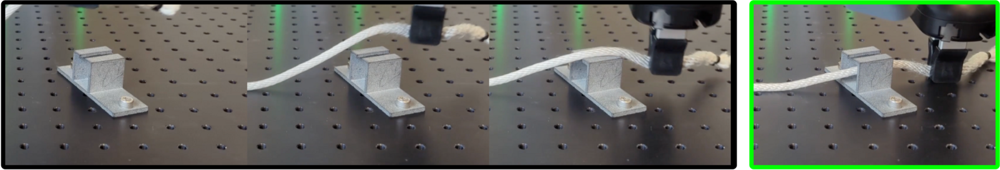
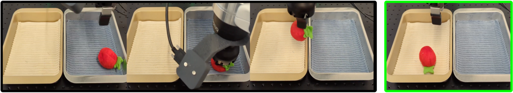
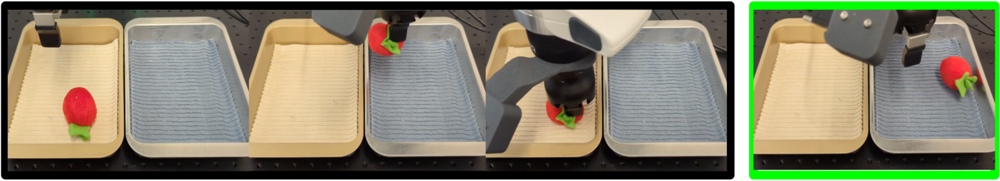

# Run with Franka Arm on Real Robot

We demonstrate how to use SERL with real robot manipulators with 4 different tasks. Namely: Peg Insertion, PCB Component Insertion, Cable Routing, and Object Relocation. We provide detailed instruction on how to reproduce the Peg Insertion task as a setup test for the entire SERL package.

When running with a real robot, a separate gym env is needed. For our examples, we isolated the gym env as a client to a robot server. The robot server is a Flask server that sends commands to the robot via ROS. The gym env communicates with the robot server via post requests.


### Installation for `serl_robot_infra`

Follow the [README](../serl_robot_infra/README.md) in `serl_robot_infra` for installation and basic robot operation instructions. This contains the instruction for installing the impendence-based [serl_franka_controllers](https://github.com/rail-berkeley/serl_franka_controllers).

After the installation, you should be able to run the robot server, interact with the gym `franka_env` (hardware).

> NOTE: The following example code will not run as it is, since it will require custom data, checkpoints, and robot env. We provide the code as a reference for how to use SERL with real robots. Learn this section in incremental order, starting from the first task (peg insertion) to the last task (bin relocation). Modify the code according to your needs.

## 1. Peg Insertion 📍


> Example is located in [examples/async_peg_insert_drq/](../examples/async_peg_insert_drq/)

> Env and default config are located in `serl_robot_infra/franka_env/envs/peg_env/`

> The `franka_env.envs.wrappers.SpacemouseIntervention` gym wrapper provides the ability to intervene the robot with a spacemouse. This is useful for demo collection, testing robot, and making sure the training Gym environment works as intended.

The peg insertion task is best for getting started with running SERL on a real robot. As the policy should converge and achieve 100% success rate within 30 minutes on a single GPU in the simplest case, this task is great for trouble-shooting the setup quickly. The procedure below assumes you have a Franka arm with a Robotiq Hand-E gripper and 2 RealSense D405 cameras.

### Procedure
1. 3D-print (1) **Assembly Object** of choice and (1) corresponding **Assembly Board** from the **Single-Object Manipulation Objects** section of [FMB](https://functional-manipulation-benchmark.github.io/files/index.html). Fix the board to the workspace and grasp the peg with the gripper.
2. 3D-print (2) wrist camera mounts for the RealSense D405 and install onto the threads on the Robotiq Gripper. Create your own config from [peg_env/config.py](../serl_robot_infra/franka_env/envs/peg_env/config.py), and update the camera serial numbers in `REALSENSE_CAMERAS`.
3. Adjust for the weight of the wrist camera by editing `Desk > Settings > End-effector > Mechnical Data > Mass`.
4. Unlock the robot and activate FCI in Desk. Then, start the franka_server by running:
    ```bash
    python serl_robo_infra/robot_servers/franka_server.py --gripper_type=<Robotiq|Franka|None> --robot_ip=<robot_IP> --gripper_ip=<[Optional] Robotiq_gripper_IP>
    ```
    This should start the impedance controller and a Flask server ready to recieve requests.
5. The reward in this task is given by checking whether the end-effector pose matches a fixed target pose. Grasp the desired peg with  `curl -X POST http://127.0.0.1:5000/close_gripper` and manually move the arm into a pose where the peg is inserted into the board. Print the current pose with `curl -X POST http://127.0.0.1:5000/getpos_euler` and update the `TARGET_POSE` in [peg_env/config.py](../serl_robot_infra/franka_env/envs/peg_env/config.py) with the measured end-effector pose.

    **Note: make sure the wrist joint is centered (away from joint limits) and z-axis euler angle is positive at the target pose to avoid discontinuities.

6. Set `RANDOM_RESET` to `False` inside the config file to speedup training. Note the policy would only generalize to any board pose when this is set to `True`, but only try this after the basic task works.
7. Record 20 demo trajectories with the spacemouse.
    ```bash
    cd examples/async_peg_insert_drq
    python record_demo.py
    ```
    The trajectories are saved in `examples/async_peg_insert_drq/peg_insertion_20_trajs_{UUID}.pkl`.
8. Edit `demo_path` and `checkpoint_path` in `run_learner.sh` and `run_actor.sh`. Train the RL agent with the collected demos by running both learner and actor nodes.
    ```bash
    bash run_learner.sh
    bash run_actor.sh
    ```
9. If nothing went wrong, the policy should converge with 100% success rate within 30 minutes without `RANDOM_RESET` and 60 minutes with `RANDOM_RESET`.
10. The checkpoints are automatically saved and can be evaluated by setting the `--eval_checkpoint_step=CHECKPOINT_NUMBER_TO_EVAL` and `--eval_n_trajs=N_TIMES_TO_EVAL` flags in `run_actor.sh`. Then run:
    ```bash
    bash run_actor.sh
    ```
    If the policy is trained with `RANDOM_RESET`, it should be able to insert the peg even when you move the board at test time.


Let's take the peg insertion task as an example. We wrapped the env as such. The composability of the gym wrappers allows us to easily add or remove functionalities to the gym env. ([code](../examples/async_peg_insert_drq/async_drq_randomized.py))

```python
env = gym.make('FrankaPegInsert-Vision-v0')  # create the gym env
env = GripperCloseEnv(env)         # always keep the gripper close for peg insertion
env = SpacemouseIntervention(env)  # utilize spacemouse to intervene the robot
env = RelativeFrame(env)           # transform the TCP abs frame of ref to relative frame
env = Quat2EulerWrapper(env)       # convert rotation from quaternion to euler
env = SERLObsWrapper(env)          # convert observation to SERL format
env = ChunkingWrapper(env)         # chunking the observation
env = RecordEpisodeStatistics(env) # record episode statistics
```


### 2. PCB Component Insertion 🖥️


> Example is located in [examples/async_pcb_insert_drq/](../examples/async_pcb_insert_drq/)

> Env and default config are located in `serl_robot_infra/franka_env/envs/pcb_env/`

Similar to peg insertion task, we define the reward in this task is given by checking whether the end-effector pose matches a fixed target pose. Update the `TARGET_POSE` in [peg_env/config.py](../serl_robot_infra/franka_env/envs/peg_env/config.py) with the measured end-effector pose.

Here we record demo trajectories with the robot, then run the learner and actor nodes.
```bash
# record demo trajectories
python record_demo.py

# run learner and actor nodes
bash run_learner.sh
bash run_actor.sh
```

A baseline of using BC as policy is also provided. To train BC, simply run the following command:
```bash
python3 examples/bc_policy.py ....TODO_ADD_ARGS.....
```

To run the BC policy, simply run the following command:
```bash
bash run_bc.sh
```

### 3. Cable Routing 🔌



> Example is located in [examples/async_cable_routing_drq/](../examples/async_cable_routing_drq/)

> Env and default config are located in `serl_robot_infra/franka_env/envs/cable_env/`

In this cable routing task, we provided an example of an image-based reward classifier. This replaced the hardcoded reward classifier which depends on the known `TARGET_POSE` defined in the `config.py`. This image-based reward classifier is pretrained ResNet10, then trained to classify whether the cable is routed successfully or not. The reward classifier is trained with demo trajectories of successful and failed samples.

```bash
# NOTE: populate the custom paths to train a reward classifier
python train_reward_classifier.py \
    --classifier_ckpt_path CHECKPOINT_OUTPUT_DIR \
    --positive_demo_paths PATH_TO_POSITIVE_DEMO1.pkl \
    --positive_demo_paths PATH_TO_POSITIVE_DEMO2.pkl \
    --negative_demo_paths PATH_TO_NEGATIVE_DEMO1.pkl \
```

The reward classifier is used as a gym wrapper `franka_env.envs.wrapper.BinaryRewardClassifier`. The wrapper classifies the current observation and returns a reward of 1 if the observation is classified as successful, and 0 otherwise.

The reward classifier is then used in the BC policy and DRQ policy for the actor node, the path is provided as `--reward_classifier_ckpt_path` argument in `run_bc.sh` and `run_actor.sh`


### 4. Object Relocation 🗑️





> Example is located in [examples/async_bin_relocation_fwbw_drq/](../examples/async_bin_relocation_fwbw_drq/)

> Env and default config are located in `serl_robot_infra/franka_env/envs/bin_env/`

This bin relocation example demonstrates the usage of forward and backward policies. Dual-task formulation is helpful for RL tasks, helping the robot to "reset". In this case, the robot is moving an object from one bin to another. The forward policy is used to move the object from the right bin to the left bin, and the backward policy is used to move the object from the left bin to the right bin.

1. Record demo trajectories

Multiple utility scripts have been provided to record demo trajectories. (e.g. `record_demo.py`: for RLPD, `record_transitions.py` for training the reward classifier, `reward_bc_demos.py`: for bc policy). Note that both forward and backward trajectories require different demo trajectories.

2. Reward Classifier

Similar to the cable routing example, we need to train two reward classifiers for both forward and backward policies. Since the observations has both wrist camera and front camera, we use a `FrontCameraWrapper(env)` to only provide the front camera image to the reward classifier.

```bash
# NOTE: populate the custom paths to train reward classifiers for both forward and backward policies
python train_reward_classifier.py \
    --classifier_ckpt_path CHECKPOINT_OUTPUT_DIR \
    --positive_demo_paths PATH_TO_POSITIVE_DEMO1.pkl \
    --positive_demo_paths PATH_TO_POSITIVE_DEMO2.pkl \
    --negative_demo_paths PATH_TO_NEGATIVE_DEMO1.pkl \
```

The reward classifiers are then used in the BC and DRQ policy for the actor node, checkpoint path is provided as `--fw_reward_classifier_ckpt_path` and `--bw_reward_classifier_ckpt_path` argument in `run_actor.sh`. To compare with BC as baseline, provide the classifier as `--reward_classifier_ckpt_path` for the `run_bc.sh` script.

3. Run 2 learners and 1 actor with 2 policies

Finally, 2 learner nodes will learn both forward and backward policies respectively. The actor node will switch between running the forward and backward policies with their respective reward classifiers during the RL training process.

```bash
bash run_actor.sh

# run 2 learners
bash run_fw_learner.sh
bash run_bw_learner.sh
```
