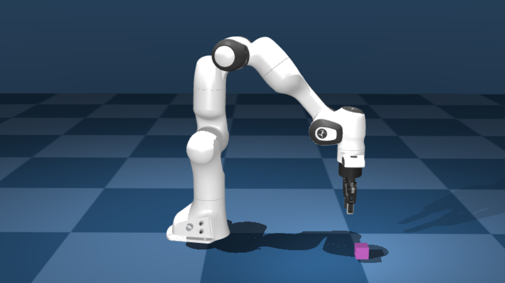

# Quick Start with SERL in Sim

This is a minimal mujoco simulation environment for training with SERL. The environment consists of a panda robot arm and a cube. The goal is to lift the cube to a target position. The environment is implemented using `franka_sim` and `gym` interface.



## Installation

**Install Franka Sim library**
```bash
    cd franka_sim
    pip install -e .
    pip install -r requirements.txt
```

Try if `franka_sim` is running via `python franka_sim/franka_sim/test/test_gym_env_human.py`.

Before beginning, please make sure that the simulation environment with `franka_sim` is working.

*Note: to set `MUJOCO_GL` as egl if you are doing off-screen rendering.
You can do so by ```export MUJOCO_GL=egl``` and remember to set the rendering argument to False in the script.
If receives `Cannot initialize a EGL device display due to GLIBCXX not found` error, try run `conda install -c conda-forge libstdcxx-ng` ([ref](https://stackoverflow.com/a/74132234))*


Optionally install `tmux`: `sudo apt install tmux`

## 1. Training from state observation example

**✨ One-liner launcher (requires `tmux`) ✨**
```bash
bash examples/async_sac_state_sim/tmux_launch.sh
```

To kill the tmux session, run `tmux kill-session -t serl_session`.

### Without using one-liner tmux launcher

You can opt for running the commands individually in 2 different terminals.

```bash
cd examples/async_sac_state_sim
```

Run learner node:
```bash
bash run_learner.sh
```

Run actor node with rendering window:
```bash
# add --ip x.x.x.x if running on a different machine
bash run_actor.sh
```

You can optionally launch the learner and actor on separate machines. For example, if the learner node is running on a PC with `ip=x.x.x.x`, you can launch the actor node on a different machine with internet access to `ip=x.x.x.x` and add `--ip x.x.x.` to the commands in `run_actor.sh`.

Remove `--debug` flag in `run_learner.sh` to upload training stats to `wandb`.

## 2. Training from image observation example

**✨ One-liner launcher (requires `tmux`) ✨**

```bash
bash examples/async_drq_sim/tmux_launch.sh
```

### Without using one-liner tmux launcher

You can opt for running the commands individually in 2 different terminals.

```bash
cd examples/async_drq_sim

# to use pre-trained ResNet weights, please download
wget https://github.com/rail-berkeley/serl/releases/download/resnet10/resnet10_params.pkl
```

Run learner node:
```bash
bash run_learner.sh
```

Run actor node with rendering window:
```bash
# add --ip x.x.x.x if running on a different machine
bash run_actor.sh
```

## 3. Training from image observation with 20 demo trajectories example

**✨ One-liner launcher (requires `tmux`) ✨**
```bash
bash examples/async_drq_sim/tmux_rlpd_launch.sh
```

### Without using one-liner tmux launcher

You can opt for running the commands individually in 2 different terminals.

```bash
cd examples/async_drq_sim

# to use pre-trained ResNet weights, please download
# note manual download is only for now, once repo is public, auto download will work
wget https://github.com/rail-berkeley/serl/releases/download/resnet10/resnet10_params.pkl

# download 20 demo trajectories
wget \
https://github.com/rail-berkeley/serl/releases/download/franka_sim_lift_cube_demos/franka_lift_cube_image_20_trajs.pkl
```

Run learner node, while provide the path to the demo trajectories in the `--demo_path` argument.
```bash
bash run_learner.sh --demo_path franka_lift_cube_image_20_trajs.pkl
```

Run actor node with rendering window:
```bash
# add --ip x.x.x.x if running on a different machine
bash run_actor.sh
```

## Use RLDS logger to save and load trajectories

This provides a way to save and load trajectories for SERL training. [Tensorflow RLDS dataset](https://github.com/google-research/rlds) format is used to save and load trajectories. This standard is compliant with the [RTX datasets](https://robotics-transformer-x.github.io/), which can potentially can be used for other robot learning tasks.

### Installation

This requires additional installation of `oxe_envlogger`:
```bash
git clone git@github.com:rail-berkeley/oxe_envlogger.git
cd oxe_envlogger
pip install -e .
```

### Usage

**Save the trajectories**

With the example above, we can save the data from the replay buffer by providing the `rlds_logger_path` argument. This will save the data to the specified path.

```bash
./run_learner.sh --log_rlds_path /path/to/save
```

This will save the data to the specified path in the following format:

```bash
 - /path/to/save
    - dataset_info.json
    - features.json
    - serl_rlds_dataset-train.tfrecord-00000
    - serl_rlds_dataset-train.tfrecord-00001
    ....
```

**Load the trajectories**

With the example above, we can load the data from the replay buffer by providing the `preload_rlds_path` argument. This will load the data from the specified path.

```bash
./run_learner.sh --preload_rlds_path /path/to/load
```

This is similar to the `examples/async_rlpd_drq_sim/run_learner.sh` script, which uses `--demo_path` argument which load .pkl offline demo trajectories.


### Troubleshooting

1. If you receive a Out of Memory error, try reducing the batch size in the `run_learner.sh` script.  by adding the `--batch_size` argument. For example, `bash run_learner.sh --batch_size 64`.
2. If the provided offline RLDS data is throwing an error, this usually means the data is not compatible with current SERL format. You can provide a custom data transform with the `data_transform(data, metadata) -> data` function in the `examples/async_drq_sim/asyn_drq_sim.py` script.
