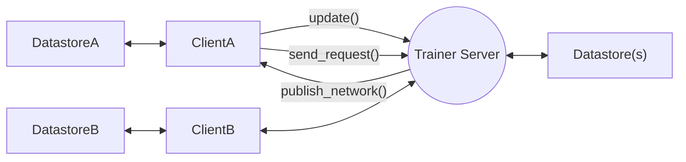

# edgeml

A simple framework for distributed machine learning applications with edge devices. Given the limitations of GPU compute for many edge devices, EdgeML facilitates a distributed data stream between edge devices and a remote GPU server. Built on a client-server architecture, EdgeML efficiently manages the transport layer for multiple clients and a central server. Moreover, Edgeml also enables async operations and inter-processes communications between different processes on a single machine.

## Installation

```bash
pip install -e .
```

For ReplayBuffer datastore functionality, install [jax](https://jax.readthedocs.io/en/latest/installation.html).

---

## Architecture

There are three types of server-client main types of classes for user to use, according to their application. Functional programming is mainly used as the API design. User can define their own callback function to process the data.

1. **Trainer compute as server: `edgeml.TrainerServer` and `edgeml.TrainerClient`**
   - `TrainerClient` provides consistent datastore update to server and gets new network

This supports distributed datastore, and enable multiple clients to send data to server. The server can then publish the new network to all clients.

*Clients can keep their own instance of their datastore, can call the `update()` method to provide the latest datastore update to the trainer server. Trainer can have its own instance of the datastore, retrieve the data and provide the trained network to client via `publish_network()` method*



---

- The current implementation mainly uses zeromq as communication protocol, it should be easy to extend it to support other protocols such as grpc. (TODO: impl abstract function when there is a need)
