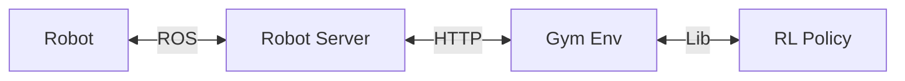

# SERL Robot Infra

All robot code is structured as follows:
There is a Flask server which sends commands to the robot via ROS. There is a gym env for the robot which communicates with the Flask server via post requests.

- `robot_server`: hosts a Flask server which sends commands to the robot via ROS
- `franka_env`: gym env for the robot which communicates with the Flask server via post requests



### Installation

First, make sure the NUC meets the specifications [here](https://frankaemika.github.io/docs/requirements.html).

Then install the `serl_franka_controllers` from: https://github.com/rail-berkeley/serl_franka_controllers

### Usage

**Robot Server**

To start using the robot, first power on the robot (small switch on the back of robot control box on the floor). Unlock the robot from the browser interface by going to robot IP address in your browser, then press the black and white button to put the robot in FCI control mode (blue light).

From there you should be able to navigate to `serl_robot_infra` and then simply run the franka server. This requires to be in a ROS environment.

```py
python serl_robot_infra/robot_servers/franka_server.py
```

This should start ROS node impedence controller and the HTTP server. You can test that things are running by trying to move the end effector around, if the impedence controller is running it should be compliant.

**Robot Env (Client)**

Lastly, we use a gym env interface to interact with the robot server, defined in this repo under `franka_env`. Simply run `pip install -e .` in the `robot_infra` directory, and in your code simply initialize the env via `gym.make("Franka-{ENVIRONMENT NAME}-v0)`.

Example Usage
```py
import gymnasium as gym
import franka_env
env = gym.make("FrankaEnv-Vision-v0")
```
