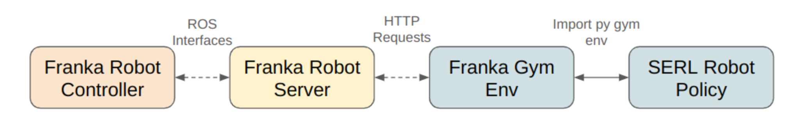

# SERL Robot Infra


All robot code is structured as follows:
There is a Flask server which sends commands to the robot via ROS. There is a gym env for the robot which communicates with the Flask server via post requests.

- `robot_server`: hosts a Flask server which sends commands to the robot via ROS
- `franka_env`: gym env for the robot which communicates with the Flask server via post requests


### Installation

1. Install `libfranka` and `franka_ros` with instructions [here](https://frankaemika.github.io/docs/requirements.html).

2. Then install the `serl_franka_controllers` from https://github.com/rail-berkeley/serl_franka_controllers

3. Then, install this package and it's dependencies.
    ```bash
    conda activate serl
    pip install -e .
    ```

### Usage

**Robot Server**

To start using the robot, first power on the robot (small switch on the back of robot control box on the floor). Unlock the robot from the browser interface by going to robot IP address in your browser, then press the black and white button to put the robot in FCI control mode (blue light).

From there you should be able to navigate to `serl_robot_infra` and then simply run the franka server. This requires to be in a ROS environment.

```bash
conda activate serl

# Script to start http server and ros controller
python serl_robot_infra/robot_servers/franka_server.py \
    --gripper_type=<Robotiq|Franka|None> \
    --robot_ip=<robot_IP> \
    --gripper_ip=<[Optional] Robotiq_gripper_IP> \
    --reset_joint_target=<[Optional] robot_joints_when_robot_resets>

# Activate the gripper after running the franka_server if you are using a Robotiq gripper
curl -X POST http://127.0.0.1:5000/activate_gripper
```

This should start ROS node impedence controller and the HTTP server. You can test that things are running by trying to move the end effector around, if the impedence controller is running it should be compliant.

The HTTP server is used to communicate between the ROS controller and gym environments. Possible HTTP requests include:

| Request | Description |
| --- | --- |
| startimp | Stop the impedance controller |
| stopimp | Start the impedance controller |
| pose | Command robot to go to desired end-effector pose given in base frame (xyz+quaternion) |
| getpos | Return current end-effector pose in robot base frame (xyz+quaternion)|
| getpos_euler | Return current end-effector pose in robot base frame (xyz+rpy)|
| getvel | Return current end-effector velocity in robot base frame |
| getforce | Return estimated force on end-effector in stiffness frame |
| gettorque | Return estimated torque on end-effector in stiffness frame |
| getq | Return current joint position |
| getdq | Return current joint velocity |
| getjacobian | Return current zero-jacobian |
| getstate | Return all robot states |
| jointreset | Perform joint reset |
| activate_gripper | Activate the gripper (Robotiq only). This needs to be run after starting franka_server to control the Robotiq gripper. |
| reset_gripper | Reset the gripper (Robotiq only) |
| get_gripper | Return current gripper position |
| close_gripper | Close the gripper completely |
| open_gripper | Open the gripper completely |
| move_gripper | Move the gripper to a given position |
| clearerr | Clear errors |
| update_param | Update the impedance controller parameters |

These commands can also be called in terminal. Useful ones include:
```bash
curl -X POST http://127.0.0.1:5000/activate_gripper # Activate gripper
curl -X POST http://127.0.0.1:5000/close_gripper # Close gripper
curl -X POST http://127.0.0.1:5000/open_gripper # Open gripper
curl -X POST http://127.0.0.1:5000/getpos_euler # Print current end-effector pose
curl -X POST http://127.0.0.1:5000/jointreset # Perform joint reset
curl -X POST http://127.0.0.1:5000/stopimp # Stop the impedance controller
curl -X POST http://127.0.0.1:5000/startimp # Start the impedance controller (**Only run this after stopimp**)
```

**Robot Env (Client)**

Lastly, we use a gym env interface to interact with the robot server, defined in this repo under `franka_env`. Simply run `pip install -e .` in the `robot_infra` directory, and in your code simply initialize the env via `gym.make("Franka-{ENVIRONMENT NAME}-v0)`.

Example Usage
```py
import gym
import franka_env
env = gym.make("FrankaEnv-Vision-v0")
```

### Provided Environments

1. peg insertion
2. pcb insertion
3. cable routing
4. bin relocation

Please refer to their respective examples in `serl/examples/` directory.
